## 1. SRCNN (ECCV'14)

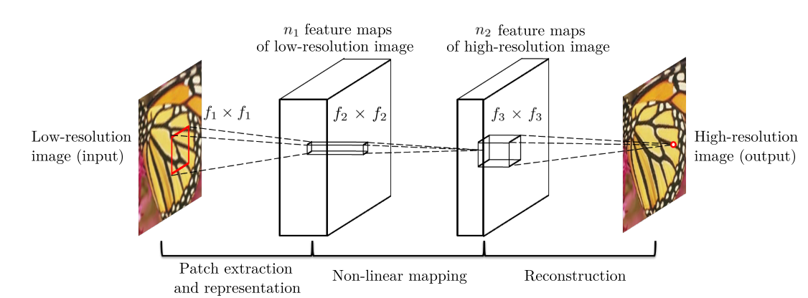

Fig.1 SRCNN

* Methodology
1. Propsed a model with three convolution layers. (fully convolution, end-to-end)
* Contribution
1. The first method proposed to use convolutional neural networks to solve SISR.
2. Demonstrate the deep learning methods can be used in SISR.
* Demerit
1. Use interplated image as input, leads to heavy comsumption.

## 2. FSRCNN (ECCV'16)

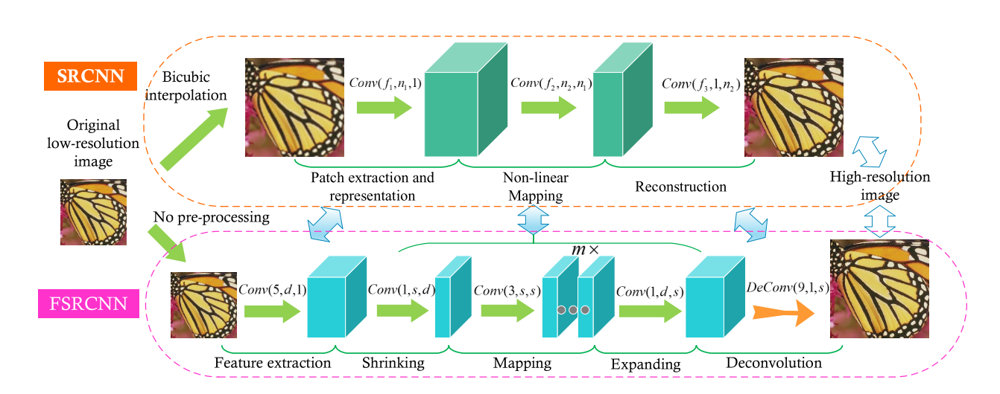

Fig.2 FSRCNN

* Methodology
1. Drop the interplation of the input image, and collaboration of a set of deconvolution layers.
* Contribution
1. Propsed a hourglass-shape CNN structure to speed-up the network inference.
2. More convolution layers.
* Demerit
1. The layers are not enough to bring the strength of deep learning.

## 3. ESPCN (CVPR'16)

Fig.3 ESPCN

* Methodology
1. Replace the deconvolution layer to a pixelshuffle layer.
* Contribution
1. Pixelshuffle layer, implicitly learns the processing necessary for SR.
* Demerit
1. The number of layers is not enough.

## 3. VDSR (CVPR'16)

Fig.3 VDSR

* Methodology
1. Stack 20 layers.
2. Add residual connection into network to speed-up the trainning process.
3. Gradient clip strategies.
* Contribution
1. Build a very deep convolutional network.
2. Cope with multi-scale SR problem in a single network.
* Demerit
1. Input image is interplated, leads to paramount complexity.

## 4. DRCN (CVPR'16)

Fig.4 DRCN

* Methodology
1. Add recursive layer (one layer 16 times recursions).
2. The output is weigted by skip connection and multiple recursive block. 
* Contribution
1. Use a single recursive layer can get a very large context.
* Demerit
1. Input image is interplated, leads to paramount complexity.

## 5. EDSR (CVPR'17)

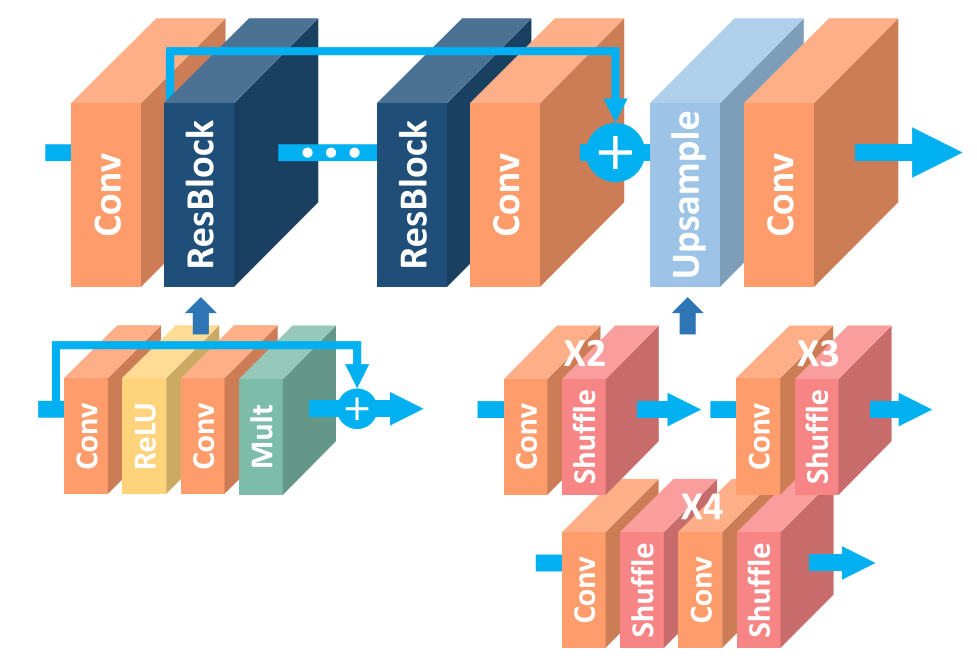

Fig.5 EDSR

* Methodology
1. Design a residual block (conv+relu+conv).
2. More residual connections.
3. Drop Batch Normalization. 
* Contribution
1. Removing unnecessary modules (BN layer) in conventional residual networks.
2. Build a deep model.
3. One model handle multi-scale tasks.

## 5. LapSRN (CVPR'17)

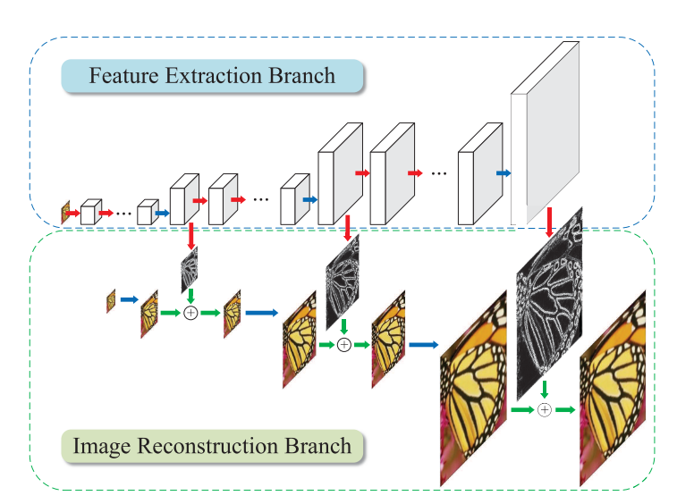

Fig.6 LapSRN

* Methodology
1. Multi-level features combination.
2. Charbonnier loss.
* Contribution
1. Laplacian Pyramid structure progressively reconstruct the sub-band residuals.
2. One model handle multi-scale tasks.

## 6. DRRN (CVPR'17)

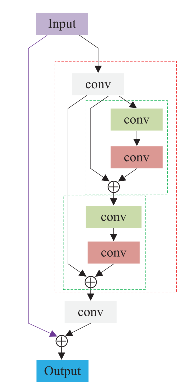

Fig.6 DRRN

* Methodology
1. Add more Local Residual connection to help gradient flow.
2. Residual recursive blocks help backpropagation.
* Contribution
1. More Local Residual connection can build deep model.
2. Residual recursive blocks save parameters and help backpropagation. 

## 7. SRGAN (CVPR'17)

Fig.7 SRGAN

* Methodology
1. Introducing the GAN structure into sisr.
2. Add a new loss.
* Contribution
1. First employ the fast feature learning in LR space.
2. Propose the perceptual loss. 

## 8. SRDenseNet (ICCV'17)

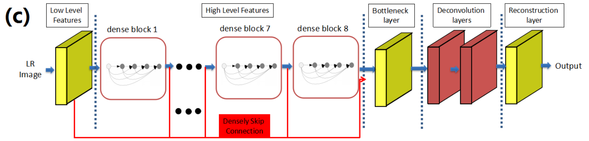

Fig.8 SRDenseNet

* Methodology
1. Add dense connection into network.
2. Combine low level and high level features.
* Contribution
1. Demonstrate that dense connection structure can achieve good performance on low-level task.

## 9. MemNet (ICCV'17)

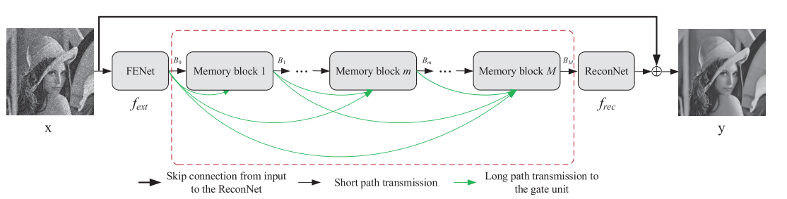

Fig.9 MemNet

* Methodology
1. Add memory gate unit to adaptively learn different weights for different memorie blocks.
2. Memory block is recursive unit.
* Contribution
1. Compared with SRDenseNet, the network steps further to adaptively learn different weights for different long-term connections.
2. Build a very deep CNN.
* Demerit
1. Input image is interplated, leads to paramount complexity.

## 10. RDN (CVPR'18)

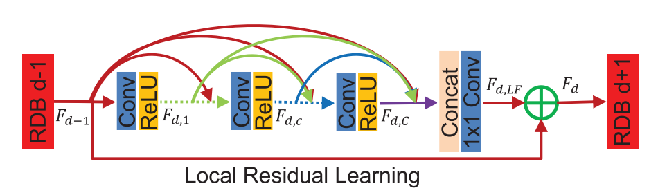

Fig.10 RDN

* Methodology
1. Each residual dense block has local residual connection.
2. Introduce previous block information into current residual dense block.
3. Add feature fusion module.
* Contribution
1. Compared with SRDenseNet, the network adds local residual connection and contiguous memory mechanism.
2. Compared with MemNet, the network does not use interplated input image and abandon recursive structure.

## 11. DSRN (CVPR'18) 

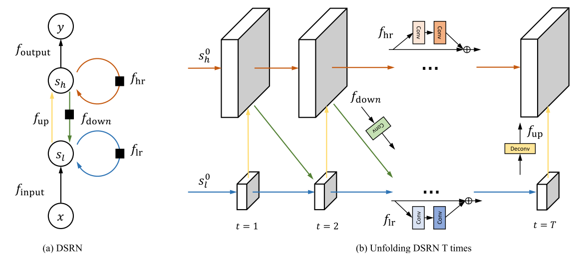

Fig.11 DSRN

* Methodology
1. Two states operate at different spatial resolutions (LR and HR).
2. Each state contains a recursive structure.
* Contribution
1. The network is parameters efficiently  and allows both LR and HR signals to contribute jointly to learning the mappings.

## 12. SRMDNF (CVPR'18) 

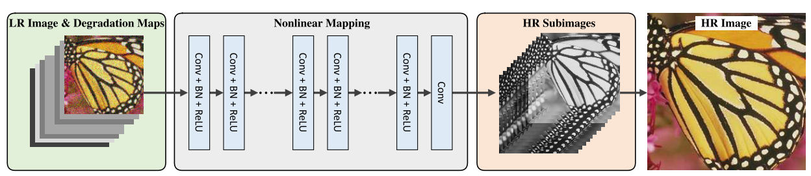

Fig.12 SRMDNF

* Methodology
1. Dimensionality stretching strategy to combine more degradational patterns.
* Contribution
1. Network not only try to solve the bicubic super-resolution problems, but also solve the spatially variant degradations.

## 13. IDN (CVPR'18) 

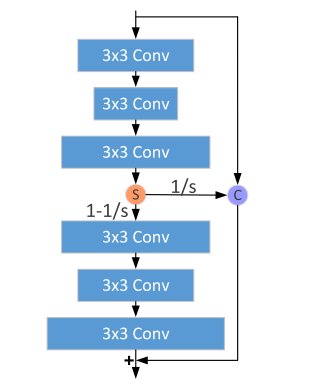

Fig.13 IDN

* Methodology
1. Split the input into different branchs.
* Contribution
1. New structure to compress the network, and distill more useful information.
2. Speed-up the inference time.

## 14. ZSSR (CVPR'18) 

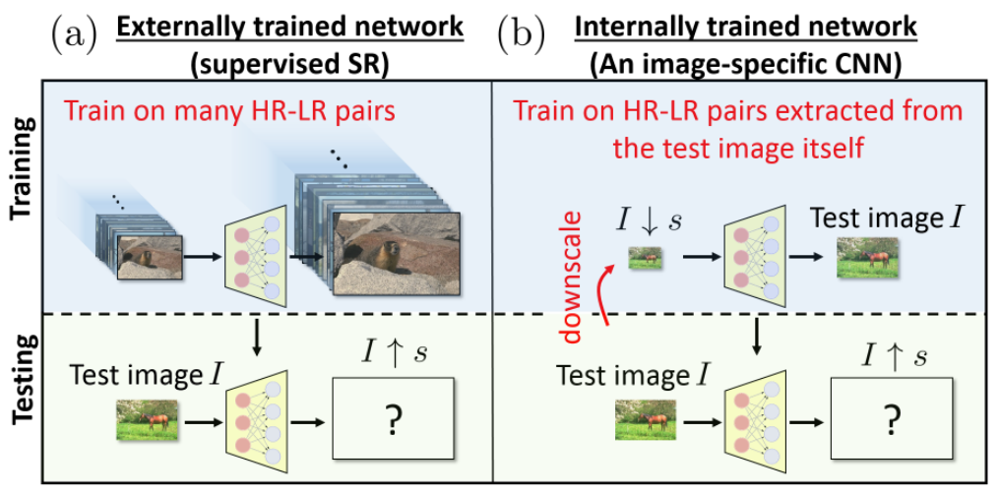

Fig.14 ZSSR

* Methodology
1. The training pair is constructed by test image itself.
2. The LR image is obtained by down-sampling the test image.
* Contribution
1. The first un-supervised sisr methods.
2. Can handle any scale tasks.

## 15. RCAN (ECCV'18) 

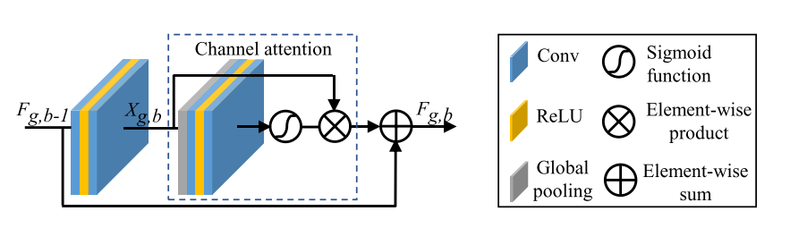

Fig.15 RCAN

* Methodology
1. Add channel attention mechanism.
2. Add residual in residual structure.
* Contribution
1. Introducing channel attention into sisr.

## 16. RCAN (ECCV'18) 

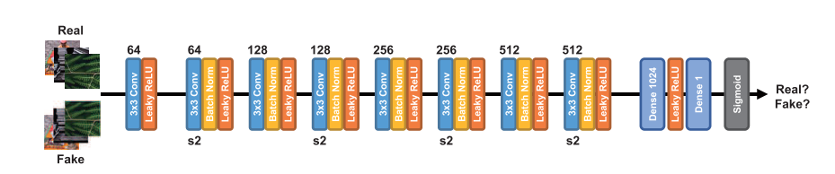

Fig.16 RCAN

* Methodology
1. GAN-based structure and residual learning.
* Contribution
1. First apply GAN to the feature domain for SISR.

## 17. MetaSR (CVPR'19) 

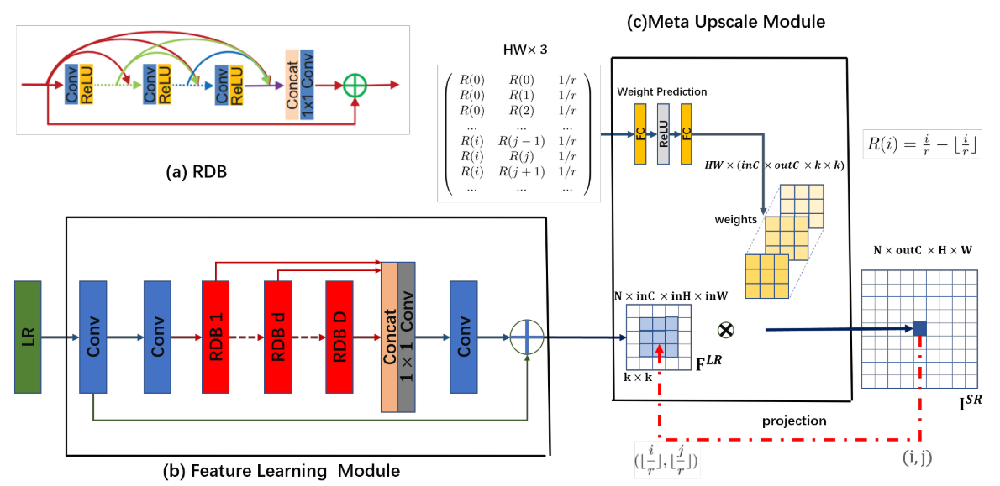

Fig.17 MetaSR

* Methodology
1. Taking the coordinate value as input to obtain the convolution kernel of any scale by MLP.
* Contribution
1. Achieving any scale sisr.
2. Achieving the comparable results with the corresponding baseline which re-trained the model for each integer scale factor.
3. Inference stage is fase.

## 18. RNAN (ICLR'19) 

Fig.18 RNAN

* Methodology
1. Introducing non-local branch.
* Contribution
1. Build non-local and local mixed attention.
2. Mixed attention helps to learn local and non-local information from the hierarchical features.

## 19. MZSR (ICLR'19) 

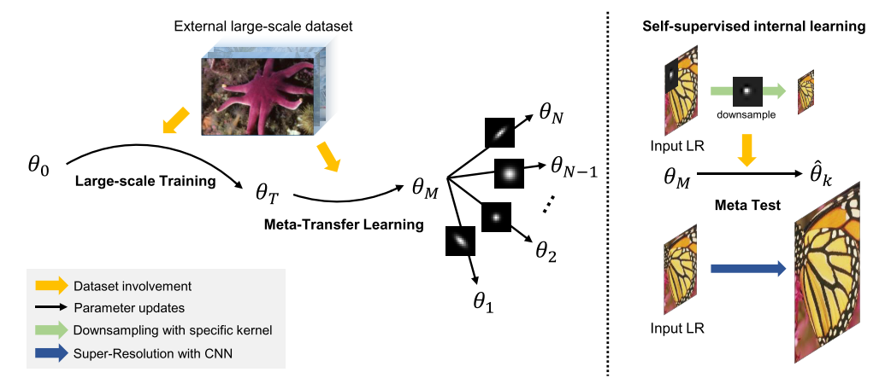

Fig.19 MZSR

* Methodology
1. Training process contains two parts, large scale training and meta-transfer learning.
2. In meta-transfer learning stage, needs diverse blur kernel add into the process.
* Contribution
1. Introducing meta-transfer learning into sisr.
2. Only one update can get good performance.
3. A flexible model.

## 20. DRN (CVPR'20) 

Fig.20 DRN

* Methodology
1. Constrain the the mappings of lr to hr and hr to lr.
* Contribution
1. A dual regression scheme to train the network.
2. Can be trained with unpaire data.

## 21. CSNLN (CVPR'20) 

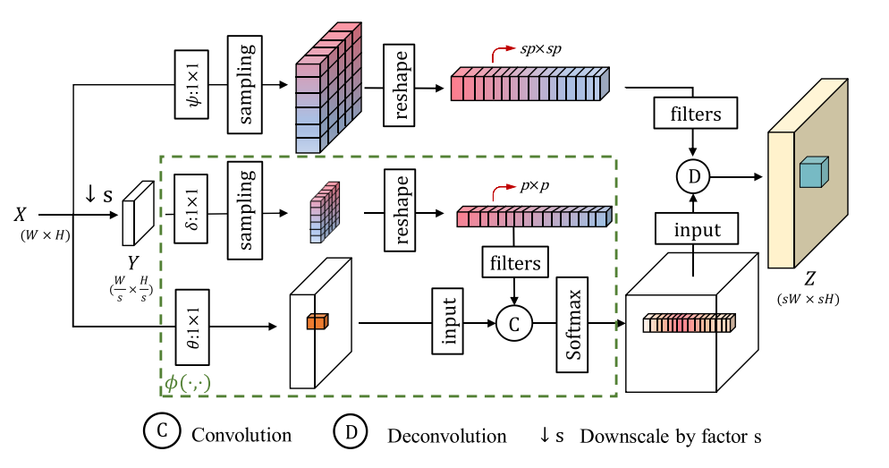

Fig.21 CSNLN

* Methodology
1. Complicated cross scale non-local attention.
2. down-sampling the input features to reduce the complexity.
* Contribution
1. Demonstrate that cross-scale attention greatly improves the sisr performance.

## 22. HAN (ECCV'20) 

Fig.22 holistic attention network

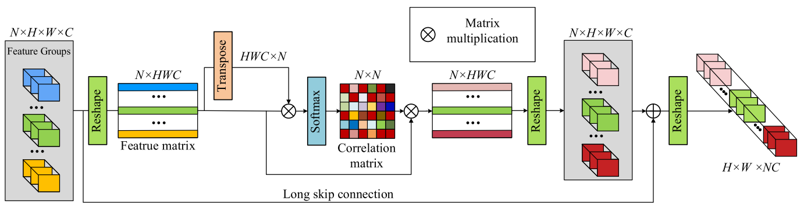

Fig.23 layer attention module

* Methodology
1. Multi-layer feature combination by layer attention module.
* Contribution
1. Holistic attention-based network.
2. Improving the SR results by modeling informative features among hierarchical layers, channels, and positions.

## 23. ClassSR (CVPR'21) 

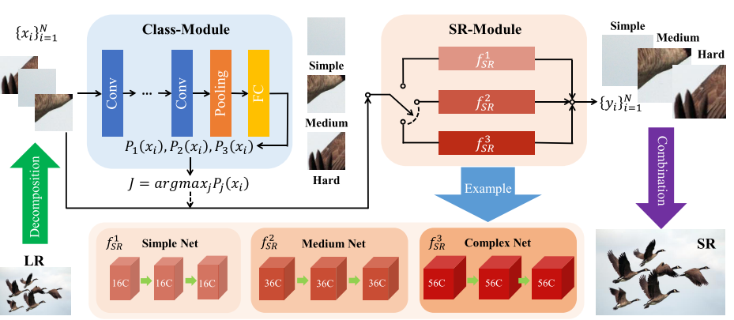

Fig.24 ClassSR

* Methodology
1. Three sr network based on the reconstruction complexity.
2. Two losses constrain the model.
* Contribution
1. Classify the each patch to different SR branch, reduce the complexity.
2. Propose two novel loss.

## 24. LUT (CVPR'21) 

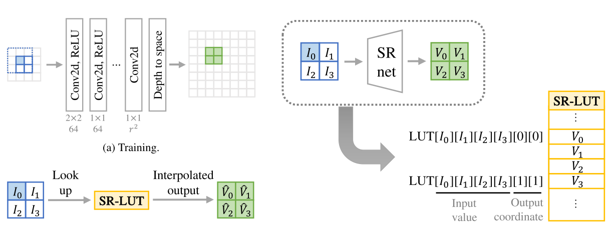

Fig.25 Look-up Table

* Methodology
1. Train a CNN model to get all pixel output in a small reception field.
2. Look up the table to get the SR pixel at inference stage.
* Contribution
1. Faster the SR process by using LUT.
2. First time to demostrate the benefits of LUTs.

## 25. SMSR (CVPR'21) 

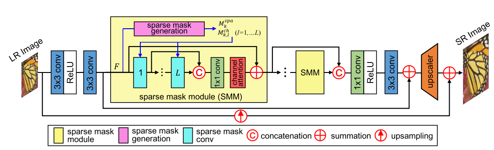

 Fig.26 SMSR 

* Methodology
1. Train a sub-network to learn the sparse mask.
2. Use sparse convolution to filter the Unnecessary part in convolution.
* Contribution
1. Exploring the sparsity in SR.
2. Propose sparse mask to reduce the complexity.

## 26. Beby-GAN (AAAI'22)
* Paper: https://ojs.aaai.org/index.php/AAAI/article/view/20030

* Contribution
1. Introduce a best-buddy loss, to an estimated HR patch, the model is to find a diverse match buddy in a vicinity of groud truth patch in different iterations.
2. Introduce a region-aware adversarial learning strategy which only feed the textured content to the discriminator to produce desirable texture.

## 26. ENLCN (AAAI'22)
* Paper: https://www.aaai.org/AAAI22Papers/AAAI-2744.XiaB.pdf

* Contribution
1. Propose to use kernel method to reduce the complexity of non-local attention method.
2. Introduce the contrast learning to filter out irrelevant information and enlarge the weight of related information.

## 26. FDIWN (AAAI'22)
* Paper: https://ojs.aaai.org/index.php/AAAI/article/view/19946

* Contribution
1. Design diverse feature distillation blocks to enhance the performance while keeping low complexity.
2. Instead of simply concating the output of each block, the paper proposed a self-calibration feature fuse block to adaptively combine the information.

## 27. IBTM (AAAI'21)
* Paper: https://ojs.aaai.org/index.php/AAAI/article/view/16263

* Contribution
1. By analysing the featrue distribution, the authors change the weight and data initiation and cancel the batch-normalization for binary convolution network, to get a better performance.
2. Introducing the distillation block to reduce the model compexities further.

## 28. MGBP (AAAI'19)
* Paper: https://ojs.aaai.org/index.php/AAAI/article/view/4979

* Contribution
1. Extend the Iterative Back–Projections (IBP) into multi–level IBP, and prove it works as well as classic IBP.
2. Introducing new method to analyze the linear components of networks.

## 29. IGNN (NIPS'20)
* Paper: https://proceedings.neurips.cc/paper/2020/file/23ad3e314e2a2b43b4c720507cec0723-Paper.pdf

* Contribution
1. Introduced the graph neural network to solve the super-resolution task.
2. Different from the existing non-local methods, the authors consider k neignbors to aggregate more relevant patches.

## 30. LAPAR (NIPS'20)
* Paper: https://proceedings.neurips.cc/paper/2020/file/eaae339c4d89fc102edd9dbdb6a28915-Paper.pdf

* Contribution
1. Treat the SISR as a linearly-assembled pixel-adaptive regression problem.
2. Introduced a set of predefine filters, and utilize a CNN to learn the coefficients, then by linear combination of these filters to get the final results.

## 31. SRCliqueNet (NIPS'19)
* Paper: https://proceedings.neurips.cc/paper/2018/file/5f93f983524def3dca464469d2cf9f3e-Paper.pdf

* Contribution
1. Slove the SR in the wavelet domain.
2. Build four sub-networks to predict the four sub-band coefficients and apply inverse discrete wavelet transform (IDWT) to reconstruct the HR image.

## 32. NLRN (NIPS'19)
* Paper: https://proceedings.neurips.cc/paper/2018/file/5f93f983524def3dca464469d2cf9f3e-Paper.pdf

* Contribution
1. Introduce a recurrent neural network (RNN)-based non-local module to solve the image restoration problem.
2. The non-local module can be plugged in any exsiting network to extract the relation between deep features.

## 33. ASSLN (NIPS'21)
* Paper: https://proceedings.neurips.cc/paper/2021/file/15de21c670ae7c3f6f3f1f37029303c9-Paper.pdf

* Contribution
1. Introduce a weight normalization method to obtain the regularizing factors to induce sparsity.
2. Propose to minimize the norm of soft mask gram matrix to allevate the filter misallignment.